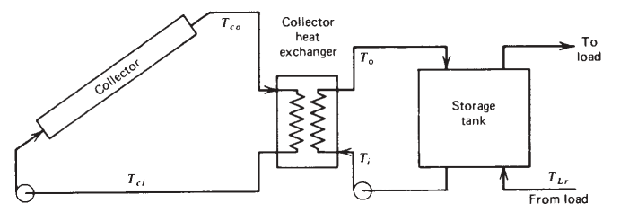

# Solar Collector Simulation (SCS)

Simulation of a system composed of solar collectors, an external heat exchanger, and an accumulator tank.

- The mathematical model was developed by following the book Solar Engineering of Thermal Processes, Fourth Edition, Duffie and Beckman.
- The software application was developed in Java by using the JavaFX library for the frontend.
- The simulation is fed with data from a typical meteorological year (TMY) provided by the Solar Energy Laboratory of Uruguay (LES) http://les.edu.uy/productos/amtues-2/. 
- The data is stored in a SQLite database.

## Table of contents
* [Requisites](#requisites)
* [Installation](#installation)
* [Usage](#usage)

## Requisites

* [Git](https://git-scm.com/downloads)
* [Java SE Development Kit 11+](https://www.oracle.com/java/technologies/javase-jdk11-downloads.html)
* [Gradle](https://docs.gradle.org/current/userguide/installation.html)

## Installation
Once the required packages are installed, clone the repository to your local system.
```
git clone https://github.com/martinnavarro198/scs.git
```
Navigate to the directory root directory of the project.

### Start scs in foreground (development mode)
```
./gradlew run
```
### Start scs in background (server mode)
```
./gradlew build
```
Two solutions are created (.tar and .zip) in the build/distributions directory.
- Extract the files and go to the bin directory.
- Run
```
./scs
```
## Usage

## Solar Collector System Schema

- Collectors are often used in combination with a heat exchanger between collector and storage allowing the use of antifreeze solutions in the collector loop.


- *Source: Solar Engineering of Thermal Processes, Fourth Edition, Duffie and Beckman*

## The Simulation
The simulation is composed of 3 panels.

- Top panel
- Bottom-Left panel
- Bottom-Right panel


## Top panel

- The top panel contains 4 tabs with different types of controllers.
- It is possible to vary some parameters within the ranges showed in the tables and visualize the real-time response in the charts.

### Collectors
- Solar collectors are an essential part of the system. In its interior, a fluid circulates which heats up due to the capture of solar radiation. This heat is subsequently stored through an accumulation system.

| Controlled parameters     | Units         | Range    |                                                                       |
| --------------------------|:-------------:| --------:| ---------------------------------------------------------------------:|
| *Tilt angle*              |  ° (degrees)  | 0 to 180 |                                    |
| *Orientation angle*       |  ° (degrees)  | 0 to 360 |                             |
| *Collection area*         |      m²       | 0.5 to 2 |                                    |
| *Number of collectors*    |       -       |  0 to *  |                                                                       |
| *Heat Loss coeficient 1*  |    W/m²°C     |  0 to *  |                                                                       |
| *Heat Loss coeficient 2*  |    W/m²°C     |  0 to *  |                                                                       |
| *Optical efficiency*      |       -       |  0 to *  |                                                                       |

&nbsp;
| Displayed parameters      | Units         | Range    |
| --------------------------|:-------------:| --------:|
| *Collector efficiency*    |       -       | 0 to 100 |

---
### Heat exchanger
- The heat exchanger is which transfers the heat captured for the fluid going through the collectors to the fluid coming from the load.

| Controlled parameters      | Units         | Range    |
| ---------------------------|:-------------:| --------:|
| *Heat Transfer coeficient* |     W/m²°C    |  0 to *  |
| *Exchange area*            |       m²      |  0 to *  |

&nbsp;
| Displayed parameters      | Units         | Range    |
| --------------------------|:-------------:| --------:|
| *Exchanger efficiency*    |       -       | 0 to 100 |

---
### Pumps
- There are 3 pumps in the system
    - The one that pumps the fluid through the collectors (Primary pump)
    - The one that pumps the fluid coming from the line into the heat exchanger (Secondary pump)
    - The one that pumps the hot fluid stored in the tank to the line (Tertiary pump)

| Controlled parameters      | Units         | Range        | Alternative control  |
| ---------------------------|:-------------:| ------------:| --------------------:|
| *Pump 1 flow rate*         |      L/s      |  0.1 to 6    |     Switch on/off    |
| *Pump 2 flow rate*         |      L/s      |  0.1 to 6    |     Switch on/off    |
| *Pump 3 flow rate*         |      L/s      |  0.1 to 1.5  |     Switch on/off    |

---
### Controllers
- It is common to implement dynamic controls that turn off Pump1 and Pump2 to avoid heat losses on cloudy days or at the night.
- Conditions:
    - Temp. Collector Out - Temp. Accumulator Out < off_value => Turn off Pump1 / Turn off Pump2
    - Temp. Collector Out - Temp. Accumulator Out > on_value => Turn on Pump1 / Turn on Pump2

- In this simulation, the initial values are off_value = 2°C and on_value = 7°C, but these values can be varied from the controllers panel.

| Controlled parameters     | Units         | Control        |
| --------------------------|:-------------:| --------------:|
| *Exchanger control*       |       -       | Switch on/off  |

| Parameter                                | Units         | Range     |
| -----------------------------------------|:-------------:| ---------:|
| *Difference in temperatures to turn off* |       °C      |  0.1 to * |
| *Difference in temperatures to turn on*  |       °C      |  0.1 to * |

---

## Bottom-Left panel

The left panel contains:
- A temperature chart showing the temperatures of the fluids in the system.
- An Irradiation chart showing the horizontal irradiation, and the irradiation that reaches the surface affected by the tilt and orientation angles.

### Temperature chart (°C)

| Parameter                     | Color         | 
| ------------------------------|:-------------:|
| *Temperature collector IN*    |     Red       | 
| *Temperature collector OUT*   |     Yellow    | 
| *Temperature accumulator IN*  |     Blue      | 
| *Temperature accumulator OUT* |     Green     | 

&nbsp;
### Irradiation chart (W/m²)
| Parameter                     | Color         | 
| ------------------------------|:-------------:|
| *Horizontal Irradiation*      |     Orange    | 
| *Tilted Irradiation*          |     Yellow    | 

---

## Bottom-Right panel

The right panel contains:

- A representation of the system Collector/Exchanger/Accumulator tank. 
- 4 boxes containing the value of temperature for each part of the system and switch buttons to enable/disable the visualization of the temperature line in the chart.
- A box on the left-top corner showing the day of the year.
- A day/night animation.


